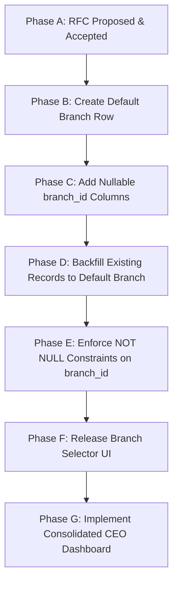

# RFC-0010 — Multi-Branch Readiness

## 1. Status
**Proposed**

---

## 2. Context
The Maison Vie Operating System (MVOS) was initialized as a single-restaurant operating system to run all departments of the flagship neoclassical villa restaurant at 28 Tăng Bạt Hổ, Hanoi. The core operational modules developed so far include:
* **Reservation Workflow**
* **Email Draft Workflow**
* **CEO Dashboard**
* **Continuous Learning**

As Maison Vie plans future business expansion to multiple branches, locations, or different culinary concepts, the underlying software architecture must be prepared to support multi-branch operations. This RFC outlines the architectural framework and data model proposal required to enable multi-branch readiness without breaking the current single-branch system.

---

## 3. Problem
Currently, all database tables and business logic assume a single-restaurant context. Operational records (reservations, emails, learning events, dashboard metrics) are stored globally without branch-level identifiers. 

If Maison Vie expands to additional branches:
* **Data Collision**: Multiple branches cannot operate from the same database instance without mixing customer reservations and emails.
* **Security & RLS Risks**: Staff at one branch could access or modify reservations from another branch due to lack of tenant partitioning.
* **Broken Dashboards**: The CEO Dashboard would consolidate all data implicitly, preventing branch-level reporting and KPI comparisons.
* **Premature Complexity**: Implementing multi-branch support directly without a structured transition plan risks introducing unnecessary code complexity and breaking existing single-branch workflows.

---

## 4. Goals
* **Architectural Blueprint**: Define a safe, step-by-step path towards multi-branch capability.
* **Domain Analysis**: Identify which system domains are branch-specific and which should remain global.
* **Backward Compatibility**: Ensure current single-branch operations at Tăng Bạt Hổ remain 100% unaffected.
* **Migration Plan**: Outline a phased strategy to backfill existing records and add branch awareness.
* **Standards Compliance**: Retain the Vietnamese frontend UI standard and English codebase/database standards.

---

## 5. Non-goals
* **No Code Implementation**: Do not write any runtime code or controllers for branch switching in this task.
* **No Database Schema Changes**: Do not modify existing PostgreSQL schemas, RLS rules, or add columns in this task.
* **No UI Changes**: Do not implement a branch selector dropdown or branch comparison dashboard yet.
* **No External Services**: Do not configure new servers or external API tenants.

---

## 6. Proposed Future Domain Model

To support branches, we propose introducing a new `branches` metadata table to define individual restaurant entities.

### Proposed Table: `branches`
```sql
CREATE TABLE IF NOT EXISTS branches (
    id UUID PRIMARY KEY DEFAULT gen_random_uuid(),
    name VARCHAR(255) NOT NULL,
    code VARCHAR(100) UNIQUE NOT NULL,
    address TEXT NOT NULL,
    phone VARCHAR(50),
    email VARCHAR(255),
    status VARCHAR(50) DEFAULT 'Active', -- Active, Inactive, Pending
    opened_at DATE,
    created_at TIMESTAMP WITH TIME ZONE DEFAULT CURRENT_TIMESTAMP NOT NULL,
    updated_at TIMESTAMP WITH TIME ZONE DEFAULT CURRENT_TIMESTAMP NOT NULL
);
```

### Proposed Default Branch Row
* **id**: `gen_random_uuid()` (e.g. default identifier)
* **name**: Maison Vie (Trụ sở chính)
* **code**: `maison_vie_main`
* **address**: 28 Tăng Bạt Hổ, Phạm Đình Hổ, Hai Bà Trưng, Hà Nội, Việt Nam
* **phone**: +84 24 3943 3888
* **email**: info@maisonvie.vn

---

## 7. Future Branch-Aware Domains

Operational data will be partitioned into branch-specific tables by adding a nullable `branch_id` column referencing `branches(id)`.

### 7.1. Branch-Specific Domains
* **reservations**: Table layout, room availability, and seating capacity are unique to each villa structure.
* **email_drafts**: Responses must use branch-specific contact information, policies, and signatures.
* **learning_events**: Lessons and corrective actions are tied to specific physical operations and staff incidents.
* **dashboard summaries**: Performance KPIs (seating occupancy, response times) must be reportable per branch.
* **inventory & stock_movements**: Physical ingredients, wine bottles, and purchase orders are stored in local branch storage rooms.
* **menu_items & recipes**: Pricing, dish availability, and portioning configurations may vary across concepts.
* **suppliers & purchase_orders**: Deliveries are addressed and routed to specific branches.
* **invoices & payments**: Financial records and cashier registers are assigned to distinct branch entities.
* **staff & shifts**: Employee scheduling, labor hours, and salary calculations are tied to branch shifts.
* **guest_feedback & reviews**: Customer feedback scores must be tracked per location.

### 7.2. Global Domains (Branch-Independent)
* **enterprise_dictionary**: Core glossary definitions and glossary terms remain global.
* **business_capability_map**: Core domains (FOH, Kitchen, Accounting) remain identical corporate capabilities.
* **brand_standards & master SOP templates**: Centralised guidelines governing service standards and neoclassical ambiance.
* **role_definitions**: System security roles (CEO, FOH Hostess, Kitchen Lead) are defined globally.
* **system_configuration**: Global system variables and environment settings.

---

## 8. Migration Strategy Proposal

To transition safely to a multi-branch system, the following phased plan is proposed:



* **Phase A — RFC Accepted**: The system architecture board reviews and signs off on the database extensions.
* **Phase B — Create Default Branch**: Run a migration script to seed the `branches` table with the flagship Hanoi branch.
* **Phase C — Add Nullable Branch References**: Add `branch_id UUID REFERENCES branches(id) ON DELETE SET NULL` to `reservations`, `email_messages`, `email_drafts`, and `learning_events` tables.
* **Phase D — Backfill Existing Records**: Update all existing data rows, assigning them to the flagship branch:
  ```sql
  UPDATE reservations SET branch_id = (SELECT id FROM branches WHERE code = 'maison_vie_main');
  ```
* **Phase E — Enforce Branch Ownership**: Alter the columns to `NOT NULL` to ensure all future transactions carry branch context.
* **Phase F — Add UI Filtering**: Introduce a branch filter option in FOH views and sảnh-specific pages.
* **Phase G — Add Branch Comparison**: Expand the CEO Dashboard to support branch-level filtering and consolidated reporting.

---

## 9. Impact Analysis

### 9.1. Reservation Workflow
* **Implication**: Room layouts, VIP Salon capacity, and dinner slots must be queried against the selected `branch_id`.
* **Risks**: Booking collisions if a customer is accidentally assigned to Salon Privé in Hanoi but arrives at a future Da Nang branch.

### 9.2. Email Draft Workflow
* **Implication**: Emails must be tagged with a target branch.
* **Risks**: FOH team drafting responses with incorrect address references or policy guidelines.

### 9.3. CEO Dashboard
* **Implication**: KPI calculation logic must filter by `branch_id` dynamically or consolidate them correctly.
* **Risks**: Mixed operational stats, double counting, or consolidated metrics reporting incorrect revenue figures.

### 9.4. Continuous Learning
* **Implication**: Learning logs must specify where the incident occurred.
* **Risks**: Staff accountability issues if an FOH error in one branch is logged under another branch.

### 9.5. Future Inventory, Finance, & HR
* **Implication**: Highly sensitive to location. Stock levels, cash register balances, and timesheets must be branch-exclusive.
* **Risks**: Tax compliance errors and cost allocation miscalculation.

---

## 10. Permission Model Considerations
Future branch security will be enforced via Supabase Row Level Security (RLS) based on user roles:
* **system_owner**: Unrestricted read/write access to all branches.
* **ceo**: Consolidated read access across all branches.
* **branch_director**: Complete read/write authority over a specific branch.
* **branch_manager**: Access restricted to their assigned branch.
* **staff**: Access restricted to shift duties within their assigned branch.

---

## 11. Dashboard Implications
The CEO Dashboard must avoid consolidating figures without clear labeling. It should distinguish:
* **Branch-specific KPIs**: Filtered views for a selected location.
* **Consolidated KPIs**: Summaries across all active branches.
* **Global KPIs**: Shared metrics (e.g., enterprise roadmap progress).
* **Data Gaps**: Unconnected systems marked per branch.

---

## 12. Open Questions
1. *Does Maison Vie need true multi-branch support or only multi-concept support?*
2. *Should central kitchen be treated as a branch, department, or facility?*
3. *Should private dining and banquet be branch-independent business units?*
4. *Should tour agency performance be branch-specific?*
5. *Should menu and recipe data be global or branch-specific?*
6. *Should supplier pricing be branch-specific?*
7. *Should staff be assigned to one branch or multiple branches?*
8. *Should CEO Dashboard default to current branch or consolidated view?*
9. *What is the minimum data required before branch comparison is meaningful?*
10. *Who approves branch creation?*

---

## 13. Decision Required
This RFC must be reviewed and approved by the Chief Systems Architect and Product Owners.
* **Option 1**: Accept RFC and implement Multi-Branch Foundation in a future task.
* **Option 2**: Keep MVOS single-branch for now.
* **Option 3**: Prepare data model only, but delay UI.
* **Option 4**: Reject multi-branch until there is a real second branch.

---

## 14. Recommended Decision
**Option 3: Prepare data model only, but delay UI.**
Prepare MVOS for multi-branch at the architecture and database schema level by drafting schema templates, but delay actual runtime code implementations until there is a confirmed operational need. This minimizes migration friction while maintaining codebase simplicity.

---

## 15. Acceptance Criteria for Future Implementation
* Default branch row is seeded.
* Nullable `branch_id` fields are successfully added to operational tables.
* Data migration backfills existing rows without data loss.
* Supabase RLS policies are updated to check user-to-branch mappings.
* UI branch filters display in Vietnamese.
* All code/database/API names remain in English.
* No consolidation KPIs are displayed without complete connection of the underlying POS data sources.
* Build, TypeScript check, and ESLint tests compile cleanly.
