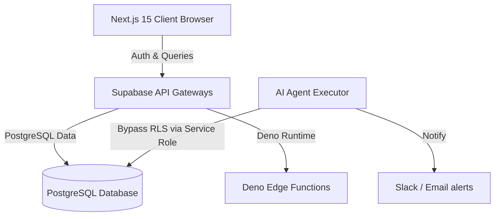

# 🏛️ MVOS Enterprise Architecture (000)

## 1. System Topology
The **Maison Vie Operating System (MVOS)** is structured as a client-server web dashboard integrated with an autonomous backend agent loop.

## 2. Component Decoupling
- **Frontend App**: Next.js 15 App router handles interactive pages (`/dashboard`, `/documents`, `/sop`, `/admin`). Uses Tailwind CSS v4 for UI layout rendering.
- **Database Engine**: Supabase (PostgreSQL) manages user identities, permissions, document catalogs, and system audit logs.
- **Agent Loops**: Autonomous nodes executing in node environments or edge runtimes that evaluate prompts, parse workflows, and log actions.
